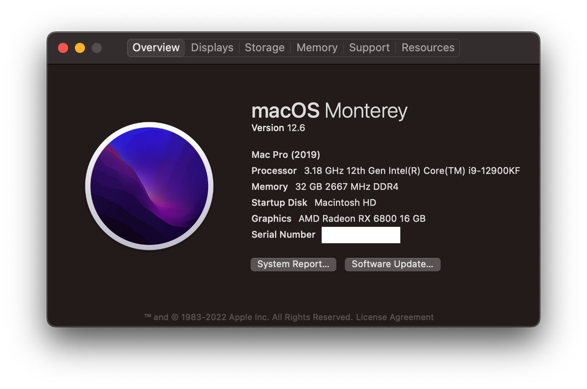

# OpenCore 0.8.4 - MSI MPG Z690 EDGE WIFI DDR4

## Only for educational purposes

[-white.svg)](https://www.apple.com/macos/monterey/)

## Specs

| Component      | Brand                                          |
|----------------|------------------------------------------------|
| **MOBO**       | `MSI MPG Z690 EDGE WIFI DDR4`                  |
| **CPU**        | `Intel Core i9-12900KF @ 2.40 GHz`             |
| **iGPU**       | `Unavailable`                                  |
| **dGPU**       | `AMD Radeon RX6800 Reference 16GB`             |
| **RAM**        | `GSkill Ripjaws V DDR4 2x16 GB @ 4000MHz CL18` |
| **Storage**    | `Team Group MP33 512GB NVMe 3.0`               |
| **LAN**        | `Intel I225-V 2.5Gbps LAN controller`          |
| **Audio Code** | `Realtek USB 2.0 based audio card`             |
| **WiFi Card**  | `Intel Wi-Fi 6 AX201 160MHz`                   |
| **OS**         | `macOS Monterey 12.6 (21G115)`                 |
| **BIOS**       | `xxxxx`                                        |

### Working/Not working:

###### Click on the arrow icons to expand the spoilers

dGPU

- [x] HDMI and DP outputs
- [x] H264 & HEVC encoding/decoding

Audio

- [x] Internal Speakers
- [x] Internal Microphone

USB

- [x] All USB ports working and mapped

Misc

  
- [x] SpeedStep with rebuilt topology
- [x] Sleep/Wake using both `hibernatemode` `0`
- [x] Wi-Fi/BT 5.0 `Intel Wi-Fi 6 AX201 160MHz` module
- [x] SATA/NVMe PCIe Gen3x4 on M.2 slot
- [x] Native NVRAM support
- [x] Recovery (macOS) boot from OpenCore
- [x] Windows 10/Linux boot from OpenCore

### Documentation

- [USB Preparing](/Docs/usb_preparation/README.md)
- [Benchmarks](/Docs/README.md#benchmarks)
- [SSDTs](/Docs/README#ssdt)
- [Drivers](/Docs/README#drivers)
- [Kexts](/Docs/Kexts.md)
- [BIOS Settings](/Docs/BIOS/README.md)
- [WiFi/BT](/Docs/wifi_and_bt/README.md)

## Issues

If you encounter any issue, please file a bugreport [here](https://github.com/relaybit/hackintosh/issues/new?assignees=realybit&labels=bug&template=generic.md&title=)

## Credits

* **Apple** for macOS
* [**Acidanthera**](https://github.com/acidanthera) for OpenCore and the majority of the kexts
* [**RehabMan**](https://github.com/RehabMan) for contributing to most of the ACPI patching guides used
* [**dreamwhite**](https://github.com/dreamwhite) for helping me optimizing this EFI and creating this GitHub repository
* **every other people that contributed to the hackintosh world :haha:**